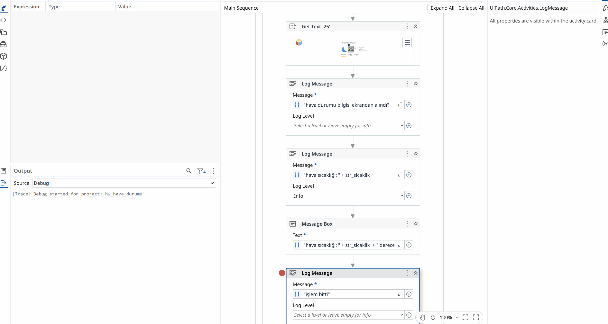

[🇹🇷 Türkçe](README.tr.md) | [🇬🇧 English](README.md)

### 🔄 İş Akış Adımları

1. **Şehir Ataması:** `Assign` aktivitesi ile hedef şehir ismi dinamik bir değişkene aktarılır.
2. **Web Tarayıcı Otomasyonu:** `Use Application Browser` ile Google web tarayıcısı başlatılarak arama çubuğuna `[Şehir İsmi] + hava durumu` ifadesi otomatik olarak yazdırılır ve `Click` ile arama yapılır.
3. **Sayfa Doğrulaması (Validation):** `Click` -> `verify` ile doğru hava durumu sayfasının ve sonuç elementlerinin yüklendiği kontrol edilir.
4. **Veri Çekme ve Bilgilendirme:** `Get text` ile güncel hava durumu bilgisi sayfadan çekilerek:
   - Sistem loglarına (`Log Message`) kaydedilir.
   - Kullanıcıya anlık bildirim (`Message Box`) olarak gösterilir.
  
   - 
